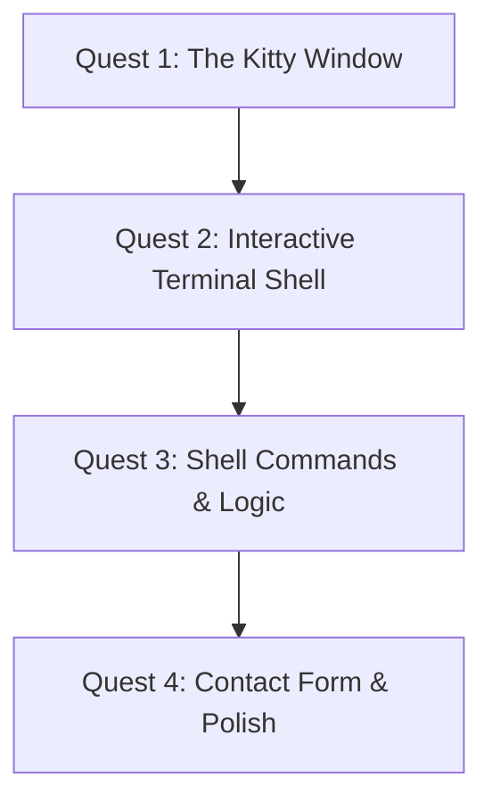

# 🕹️ Gamified Web Dev Quest: Build Your Terminal Portfolio!

Welcome to your web development learning quest! You are going to build a terminal-themed portfolio, and in the process, master **React, TypeScript, CSS Variables, State Management, and Event Handling**. 

This project is broken down into **4 Quests**, each consisting of several **Missions**. Completing a mission unlocks the next one, awards you **XP (Experience Points)**, and unlocks **Achievements**. Along the way, we'll explain the concepts under the hood so you learn *why* things work.

---

## 🎨 Design Spec: Your Kitty Terminal Setup

Based on your feedback, this project focuses **exclusively** on a high-fidelity terminal console with your exact setup:

*   **Background Wallpaper**: A deep celestial space background with starry elements and blurred planet shapes.
*   **Terminal Container**: A floating, semi-transparent dark pane (`rgba(27, 27, 36, 0.85)`) with rounded corners and a thin sleek border, mirroring your Kitty terminal window.
*   **Prompt Customization**:
    *   **Line 1**: `╭─ 󰊠 billa at ~` (with real-time clock right-aligned: `🕒 21:20`).
    *   **Line 2**: `╰─> ` (followed by your command cursor).
*   **Pokemon Art**: A pixel-art sprite (starting with Regirock!) rendered in the top-left area when the terminal first boots up or when running a custom command like `pokemon`.

---

## 🗺️ The Adventure Map

---

## 🏆 Current Stats & Leaderboard
*   **Player**: Dev Intern
*   **Current Quest**: None
*   **XP**: `0 / 2000`
*   **Level**: `1 (Novice Coder)`
*   **Achievements Unlocked**: None

---

## 📜 Quest Line Breakdown

### 🟢 Quest 1: The Kitty Window (Total XP: 500)
*Learn the basics of Vite, TypeScript structures, and styling a custom environment.*

*   **Mission 1.1: Project Genesis (+150 XP)**
    *   **Task**: Run the Vite CLI tool to bootstrap the React + TS skeleton in `/home/billa/proj/my-portfolio`, clean up the default boilerplate files, and understand the project files (`index.html`, `main.tsx`, `package.json`).
    *   **Concept Unlocked**: *How Vite bundlers run and how npm scripts compile TypeScript.*
    *   **Achievement**: `First Boot 🚀`

*   **Mission 1.2: Celestial Space & Transparency (+150 XP)**
    *   **Task**: Configure `index.css` with a deep-space starry background, planetary gradient overlays, and import custom monospace fonts (`JetBrains Mono` / `Fira Code`).
    *   **Concept Unlocked**: *CSS backgrounds, layout systems, and font faces.*
    *   **Achievement**: `Cosmic Canvas 🌌`

*   **Mission 1.3: Kitty Window Frame (+200 XP)**
    *   **Task**: Build a styled container box that mimics your Kitty window, featuring a semi-transparent background, thin borders, rounded corners, drop shadows, and a top bar containing the window title ("Kitty Terminal").
    *   **Concept Unlocked**: *CSS backdrop-filters, absolute center positioning, and relative layouts.*
    *   **Achievement**: `Window Architect 🪟`

---

### 🟡 Quest 2: Interactive Terminal Shell (Total XP: 500)
*Master React State, side-effects (`useEffect`), and complex keyboard event capturing.*

*   **Mission 2.1: Boot Sequence Simulator (+150 XP)**
    *   **Task**: Create a simulated booting sequence outputting scrolling boot logs when the app loads, finishing with displaying the **Regirock pixel art** and prompt.
    *   **Concept Unlocked**: *Asynchronous JavaScript (`setTimeout`), and React `useEffect` hooks.*
    *   **Achievement**: `System Booted ⚡`

*   **Mission 2.2: Double-Line Command Input (+200 XP)**
    *   **Task**: Build a custom terminal command input element mimicking your two-line prompt: Line 1 showing `╭─ billa at ~` (with real-time clock on the right) and Line 2 showing `╰─>`. Ensure clicking anywhere focuses input.
    *   **Concept Unlocked**: *Controlled React inputs, ref management (`useRef`), and global window key listeners.*
    *   **Achievement**: `Keyboard Warrior ⌨️`

*   **Mission 2.3: Shell Enhancements (+150 XP)**
    *   **Task**: Add command history (cycling previous commands using the `Up` and `Down` arrow keys) and tab-completion for matching command names.
    *   **Concept Unlocked**: *Array manipulation, indexing pointers in React state, keycodes (`Tab`, `ArrowUp`).*
    *   **Achievement**: `Shell Power-User 🐚`

---

### 🟠 Quest 3: Shell Commands & Logic (Total XP: 500)
*Implement conditional rendering, structural code organization, and custom ASCII styles.*

*   **Mission 3.1: Command Router (+150 XP)**
    *   **Task**: Create a separate router utility (`commands.tsx`) that maps text inputs to custom visual outputs. Support `help`, `about`, and `clear`.
    *   **Concept Unlocked**: *Pure functions, mapping string keys to React components.*
    *   **Achievement**: `Command Commander 📡`

*   **Mission 3.2: Graphical Tech Stack & Projects (+200 XP)**
    *   **Task**: Design custom ASCII bar charts for your `skills` command and clean layout grids for your `projects` command.
    *   **Concept Unlocked**: *Grid and Flexbox layouts, mapping data arrays to visual components.*
    *   **Achievement**: `Flexbox Sculptor 🧱`

*   **Mission 3.3: Sudo Wrecker (+150 XP)**
    *   **Task**: Add the easter egg `sudo rm -rf /` command. When run, it displays flashing warning banners, types out simulated wiping directories, and triggers a full UI reload.
    *   **Concept Unlocked**: *State cleanup, interval timing, and visual alert triggers.*
    *   **Achievement**: `System Breaker ⚠️`

---

### 🔵 Quest 4: Contact Form & Polish (Total XP: 500)
*Implement custom shell prompt interactions and responsive font scaling.*

*   **Mission 4.1: Interactive Shell Form (+250 XP)**
    *   **Task**: Build an interactive form *directly inside the shell* for contact information. (e.g. typing `contact` prompts for "Your Name:", "Your Email:", "Message:" one by one).
    *   **Concept Unlocked**: *State machine inside shell, progressive rendering.*
    *   **Achievement**: `Console Formmaster 📄`

*   **Mission 4.2: Mobile Scaling & Final Polish (+250 XP)**
    *   **Task**: Ensure the terminal is fully responsive and usable on mobile devices, adjusting font sizes, wrapping long text cleanly, and fixing virtual keyboard overlay bugs.
    *   **Concept Unlocked**: *CSS media queries, responsive units (vw, rem), viewport heights.*
    *   **Achievement**: `Mobile Hacker 📱`

---

## 🕹️ Ready to Play?

Let's begin! To start Quest 1, we must **initialize the project folder and understand its files**. 

Give the approval signal, and I will set up the first quest!
